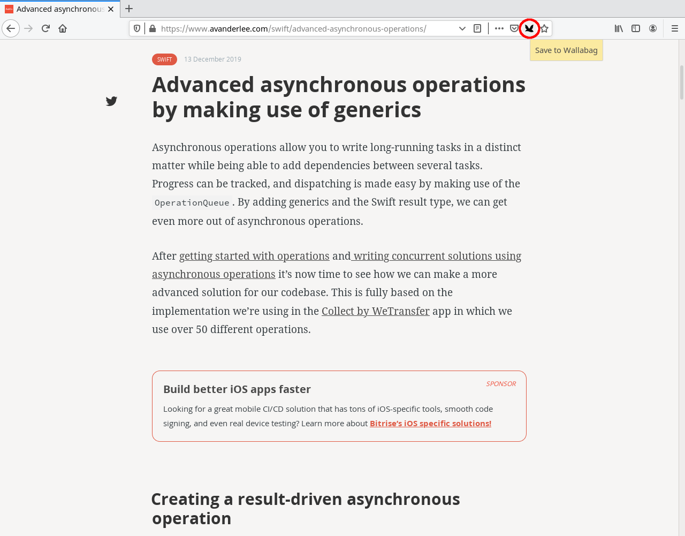

# Wallabaggerini

This is a drop-in replacement for the Wallabag bookmarklet as a page action. I did this
because after having used Pocket for some time, the URL bar felt like the most natural
placement of the button to me.

The default [Wallabagger] extension is more powerful than the bookmarklet but I did not
want to use it at the time of writing this because it stored the account password in plain
text in the browser storage.

## Installing

You can install the extension directly from the official [addons.mozilla.org] website.

## Running (from Code)

For development and testing you can run the extension from code in an isolated browser
instance through `./web-ext run`.

## License

Wallabaggerini is licensed under the GNU General Public License as published by the
Free Software Foundation, either version 3 of the License, or (at your option) any
later version.

[Wallabagger]: https://addons.mozilla.org/en-US/firefox/addon/wallabagger/
[addons.mozilla.org]: https://addons.mozilla.org/en-US/firefox/addon/wallabaggerini/
